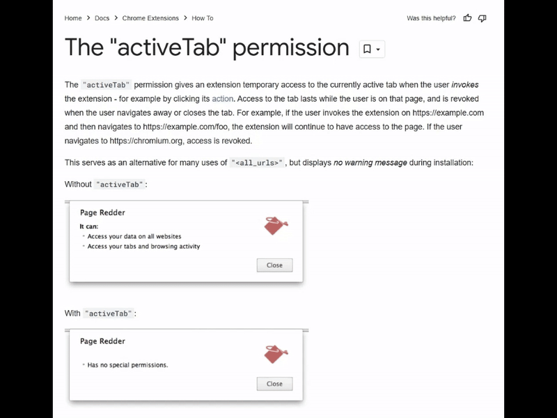

# Broomstick

Control what fonts your chrome browser uses!

## Developer Guide
1. Clone the repository into your local machine.
2. Follow https://support.google.com/chrome/a/answer/2714278?hl=en to load the extension its source code into your chrome browser.
